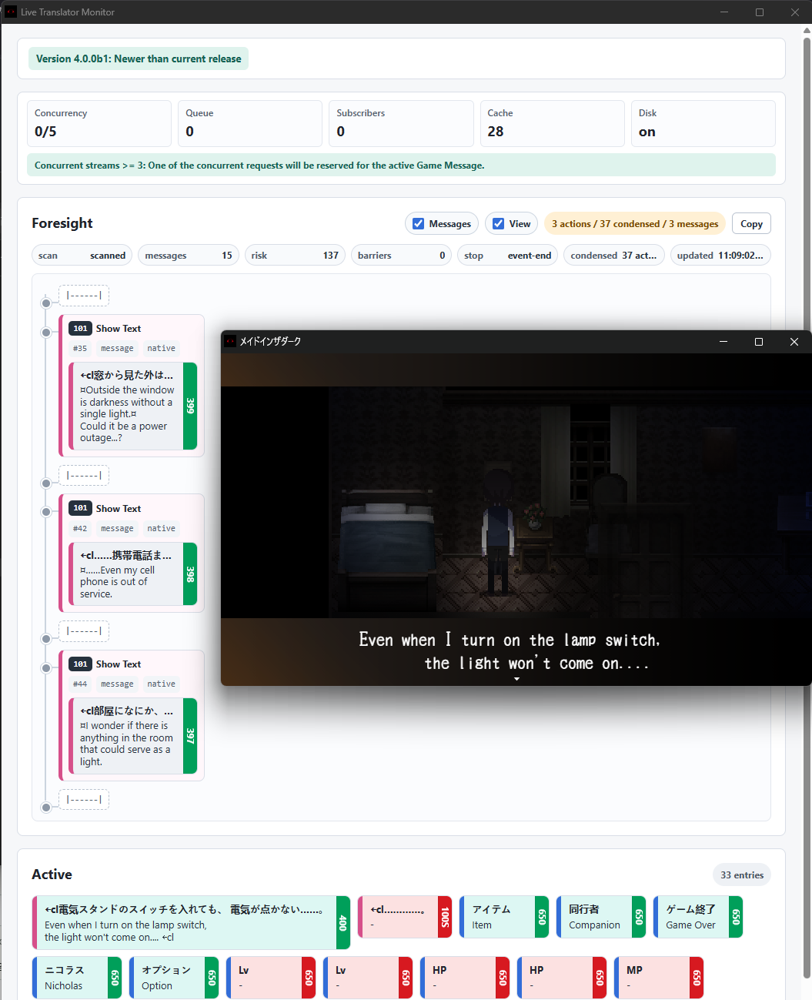
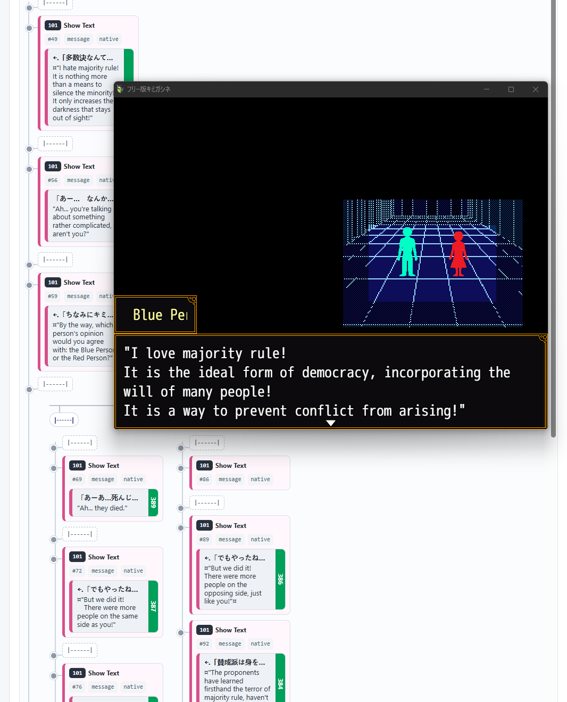

## Personal fork notice / 개인 fork 안내

KO: 이 저장소는 upstream `nt7011/RPG-Maker-Live-Translator`의 `release` 브랜치, `dist-4.0.0b5` 계열을 기반으로 만든 개인 fork입니다. llama.cpp의 OpenAI 호환 endpoint(`/v1/models`, `/v1/chat/completions`) 지원을 추가했으며, 원본 저장소와 독립적으로 운영합니다.

EN: This repository is a personal fork based on upstream `nt7011/RPG-Maker-Live-Translator` `release`, around the `dist-4.0.0b5` line. It adds llama.cpp OpenAI-compatible endpoint support (`/v1/models`, `/v1/chat/completions`) and is maintained independently from the original repository.

## Overview
RPG Maker MV / MZ Live Translator - Simply translates the text on the game screen (does its best).

Supports most games. Since RPG Maker is a scriptable platform, no implementation of a translator will work against every game. Chances are that some games will have subtle issues or won't work at all.

Intended to be used with LM Studio or llama.cpp (but deepl API key support exists as well for users without a GPU - for now)

<p>
  
  
</p>

## How it works

1. Intercepts all kinds of text draw.
2. See if cached translation is available.
3. If not, asynchronous translation request is sent to the LLM.
4. When ready, fulfill the promise by clearing out the original and draw the translation in place.
5. Foresight: Tries to peek ahead of the dialogue and finds texts to pre-translate. Branching paths (user choices, if's) are supported.

## Web Installer
Simply visit https://nt7011.github.io/ with a Chromium browser and point the game folder. The rest the will be taken care of.

KO: 이 개인 fork의 llama.cpp 변경을 쓰려면 이 checkout에서 Local Installer 또는 Manual Installation을 사용하세요. upstream web installer는 원본 release를 설치할 수 있으며, 이 fork의 변경을 포함하지 않을 수 있습니다.

EN: To use this personal fork's llama.cpp changes, install from this checkout with Local Installer or Manual Installation. The upstream web installer can install upstream releases and may not include this fork's changes.

## Prerequisites:
1. If there's no `scripts/` in your game folder, it's probably been hidden inside `.exe` with Enigma Virtual Box. Unpack first. 
2. (Required for most games) Update the game's included nw.js library. All RPGMV/MZ games ship with nwjs installations - sometimes with very outdated ones that will not work with this addon. https://nwjs.io/downloads/ - Extract all files to the game directory (where Game.exe is) and change the name of nwjs.exe to Game.exe. 

## Alternative Installations

### Local Installer
- Run `powershell -ExecutionPolicy Bypass -File local-installer\installer.ps1 -GameRoot "C:\Path\To\Game"`. If the release folders are already copied next to `Game.exe`, `-GameRoot` can be omitted.

### Manual Installation
1. Copy `live-translator/` to `js/plugins/live-translator/` or `www/js/plugins/live-translator/`.
2. Copy `live-translator/config-templates/settings.release.json` to `js/plugins/live-translator/settings.json` or `www/js/plugins/live-translator/settings.json`.
3. Add an enabled `plugins.js` entry named `live-translator/live-translator-loader`.
4. Inspect `package.json` and make sure `name` field is not empty.

Then, go to `js/plugins/live-translator/` or `www/js/plugins/live-translator/` to edit `translator.json` for provider settings and `settings.json` for addon behavior.

## Settings

`translator.json` controls the translation provider and local LLM server. `settings.json` controls addon behavior such as text eligibility, display scaling, regex rules, diagnostics, and cache.

`translator.json` example for llama.cpp:

```json
{
    "provider": "local",
    "settings": {
        "local": {
            "api_type": "llamacpp",
            "address": "127.0.0.1",
            "port": 18080,
            "model": "gemma-4-26B-A4B-it-ultra-uncensored-heretic-Q3_K_M.gguf",
            "system_prompt": "Translate the user's text into Korean. Preserve every ¤ character exactly in the right place. Preserve existing line breaks exactly. Return only the translated text.",
            "chat_template_kwargs": {
                "enable_thinking": false
            },
            "temperature": 1,
            "top_p": 0.95,
            "top_k": 64,
            "min_p": 0.05,
            "repeat_penalty": 1.1
        }
    }
}
```

For llama.cpp, `settings.local.api_type` must be `"llamacpp"` in `translator.json`. With `address` set to `127.0.0.1` and `port` set to `18080`, the runtime and precacher check `http://127.0.0.1:18080/v1/models` and send chat requests to `http://127.0.0.1:18080/v1/chat/completions`. Set `settings.local.model` to the `id` value returned by `/v1/models`.

## settings.json Configuration / settings.json 설정법

`settings.json` is installed at `js/plugins/live-translator/settings.json` or `www/js/plugins/live-translator/settings.json`. For manual installs, start by copying `live-translator/config-templates/settings.release.json` to that location.

Recommended `settings.json` fragment for English or other non-CJK source games:

```json
{
    "translation": {
        "disableCjkFilter": true,
        "maxOutputTokens": 512
    },
    "textEligibility": {
        "skipEmpty": true,
        "skipNative": true,
        "skipCounterLike": true,
        "skipSkipped": true,
        "cjk": {
            "requireJapaneseOrChinese": false,
            "skipKorean": false
        }
    }
}
```

### 한국어 설명

- `translation.disableCjkFilter`: 기존 호환용 CJK 필터 스위치입니다. `false`이면 기본적으로 일본어/중국어가 들어간 텍스트만 번역 provider 요청 대상으로 보고, 이미 한국어가 들어간 텍스트는 건너뜁니다. `true`이면 영어 같은 non-CJK 텍스트도 런타임 번역 대상이 되며, precacher 추출에서도 CJK 문자가 없어도 받아들입니다.
- `translation.maxOutputTokens`: local provider의 최대 출력 토큰 수입니다. llama.cpp 요청에서는 `max_tokens`로 전송됩니다. 기본값은 `512`입니다.
- `textEligibility.skipEmpty`: 빈 문자열이나 공백뿐인 텍스트를 건너뜁니다.
- `textEligibility.skipNative`: adapter가 native/skip 대상으로 표시한 텍스트를 건너뜁니다.
- `textEligibility.skipCounterLike`: 숫자, 짧은 카운터, 수치 UI처럼 번역하면 안 되는 텍스트를 건너뜁니다.
- `textEligibility.skipSkipped`: 이미 `skipped` 상태인 항목을 다시 번역하지 않습니다.
- `textEligibility.cjk.requireJapaneseOrChinese`: `true`이면 일본어/중국어 문자가 없는 텍스트를 provider 요청에서 제외합니다.
- `textEligibility.cjk.skipKorean`: `true`이면 한국어가 들어간 텍스트를 provider 요청에서 제외합니다.
- `translation.disableCjkFilter: true`는 런타임에서 기본 CJK 조건을 풀어 `requireJapaneseOrChinese: false`, `skipKorean: false`처럼 동작하게 합니다. 단, `textEligibility.cjk.*` 값을 직접 쓰면 그 값이 우선합니다. Precacher는 현재 `translation.disableCjkFilter`를 읽으므로, 영어 원문을 미리 추출하려면 이 legacy 키를 같이 사용합니다.
- `ignoreTranslationRegex`: regex 문자열 배열입니다. 매칭된 텍스트는 번역 요청에서 제외합니다. 예: `["/^\\d+$/", "/^Now Loading/i"]`.
- `overrideTranslationRegex`: `{ "regex": "...", "translation": "..." }` 객체 배열입니다. 매칭되면 LLM을 호출하지 않고 지정한 번역을 바로 사용합니다.
- `substitutePlaintextBeforeTranslation`: `{ "from": "...", "to": "..." }` 객체 배열입니다. LLM에 보내기 전에 단순 문자열 치환을 적용합니다.
- `gameMessage.textScale`: 메시지창 번역 글자 크기 비율입니다. `1`부터 `100`까지의 정수를 사용하며, `100`은 원래 크기입니다.
- `gameMessage.originAwareLineBreaks`: 원문 줄바꿈을 더 의식해서 메시지창 번역 줄바꿈을 처리합니다.
- `textScaleOthers`: 메시지창 외 window, sprite, pixi 텍스트 번역의 글자 크기 비율입니다. `1`부터 `100`까지의 정수를 사용합니다.
- `redraw.extraPadding`: redraw 영역에 추가 여백을 줍니다.
- `redraw.defaultOutline`: redraw 텍스트 outline 보정값입니다.
- `bitmapFallback.mode`: bitmap text fallback 방식을 정합니다. 기본값은 `"redraw"`입니다.
- `enableForesight`: 대화/이벤트를 미리 훑어 선번역하는 foresight 기능을 켜거나 끕니다.
- `showForesightSpoilers`: GUI에서 foresight가 찾은 미래 텍스트 내용을 보여줄지 정합니다.
- `checkUpdates`: GUI의 업데이트 체크를 켜거나 끕니다.
- `Snapshot.ForceAsyncTranslation`: snapshot 번역을 강제로 비동기 처리합니다.
- `diskCache.enabled`: `translation-cache.log` 기반 디스크 캐시를 켜거나 끕니다.
- `diskCache.maxMegabytes`: 디스크 캐시 최대 크기입니다.
- `diskCache.clearOnLaunch`: 실행할 때 기존 디스크 캐시를 비웁니다.
- `logging.enabled`: console logging을 켜거나 끕니다.
- `logging.suppressExact`: 정확히 일치하는 로그나 regex로 매칭되는 로그를 숨깁니다.
- `debug.level`: 로그 상세도입니다. `error`, `warn`, `info`, `debug`, `trace`를 사용할 수 있습니다.
- `diagnostics.performanceMode` 또는 `diagnostics.mode`: GUI 진단 상세도를 정합니다. `none`, `performance`, `full` 계열 값을 사용할 수 있습니다.
- `drawCaptureTrace.enabled`: 번역 항목으로 올라오지 못한 draw 후보 추적을 켭니다.
- `drawCaptureTrace.recordCjk`: CJK 텍스트 draw 후보를 기록합니다.
- `drawCaptureTrace.recordAll`: 모든 draw 후보를 기록합니다.
- `drawCaptureTrace.limit`: 보관할 draw trace 개수입니다.
- `drawCaptureTrace.targetTexts`: 특정 문자열이 포함된 draw 후보만 추적하고 싶을 때 사용합니다.
- `performanceProfiler.enabled`: 프레임과 hook 성능 profiler를 켭니다.

### English explanation

- `translation.disableCjkFilter`: Legacy compatibility switch for the CJK gate. When `false`, provider requests normally require Japanese or Chinese text, and Korean text is skipped. When `true`, non-CJK sources such as English can be translated at runtime, and the precacher accepts strings even when they do not contain CJK characters.
- `translation.maxOutputTokens`: Maximum local provider output tokens. For llama.cpp requests, this is sent as `max_tokens`. The default is `512`.
- `textEligibility.skipEmpty`: Skips empty or whitespace-only text.
- `textEligibility.skipNative`: Skips text that an adapter marked as native or not translatable.
- `textEligibility.skipCounterLike`: Skips numbers, short counters, and UI-like numeric text that should not be translated.
- `textEligibility.skipSkipped`: Does not re-translate items already marked as `skipped`.
- `textEligibility.cjk.requireJapaneseOrChinese`: When `true`, text without Japanese or Chinese characters is not sent to the provider.
- `textEligibility.cjk.skipKorean`: When `true`, text containing Korean is not sent to the provider.
- `translation.disableCjkFilter: true` relaxes the runtime CJK defaults so they behave like `requireJapaneseOrChinese: false` and `skipKorean: false`. Explicit `textEligibility.cjk.*` values override those defaults. The precacher currently reads `translation.disableCjkFilter`, so keep that legacy key when you want English source text to be extracted.
- `ignoreTranslationRegex`: Array of regex strings. Matching text is excluded from translation requests. Example: `["/^\\d+$/", "/^Now Loading/i"]`.
- `overrideTranslationRegex`: Array of `{ "regex": "...", "translation": "..." }` objects. Matching text uses the provided translation without calling the LLM.
- `substitutePlaintextBeforeTranslation`: Array of `{ "from": "...", "to": "..." }` objects. Applies plain string replacement before sending text to the LLM.
- `gameMessage.textScale`: Translation font-size percentage for message windows. Use an integer from `1` to `100`; `100` keeps the original size.
- `gameMessage.originAwareLineBreaks`: Makes message-window wrapping pay more attention to the original line breaks.
- `textScaleOthers`: Translation font-size percentage for non-message window, sprite, and pixi text. Use an integer from `1` to `100`.
- `redraw.extraPadding`: Adds padding around redraw regions.
- `redraw.defaultOutline`: Adjusts the fallback outline used during redraw.
- `bitmapFallback.mode`: Selects the bitmap text fallback behavior. The default is `"redraw"`.
- `enableForesight`: Enables or disables foresight pre-translation scanning.
- `showForesightSpoilers`: Controls whether the GUI shows future text found by foresight.
- `checkUpdates`: Enables or disables GUI update checks.
- `Snapshot.ForceAsyncTranslation`: Forces snapshot translation to run asynchronously.
- `diskCache.enabled`: Enables or disables the `translation-cache.log` disk cache.
- `diskCache.maxMegabytes`: Maximum disk cache size.
- `diskCache.clearOnLaunch`: Clears the disk cache on launch.
- `logging.enabled`: Enables or disables console logging.
- `logging.suppressExact`: Hides exact log messages or logs matching configured regex entries.
- `debug.level`: Log detail level. Supported values are `error`, `warn`, `info`, `debug`, and `trace`.
- `diagnostics.performanceMode` or `diagnostics.mode`: Controls GUI diagnostics detail. Supported families include `none`, `performance`, and `full`.
- `drawCaptureTrace.enabled`: Enables tracing for draw candidates that did not become translation items.
- `drawCaptureTrace.recordCjk`: Records CJK draw candidates.
- `drawCaptureTrace.recordAll`: Records every draw candidate.
- `drawCaptureTrace.limit`: Number of draw trace entries to keep.
- `drawCaptureTrace.targetTexts`: Filters tracing to draw candidates containing specific strings.
- `performanceProfiler.enabled`: Enables the frame and hook performance profiler.

## Translator GUI
The translator monitor opens automatically when the game starts. If you close it, press `Ctrl+Shift+Enter` in the game window or run `LiveTranslatorGui.open()` from DevTools.

## TPS Monitor / TPS 모니터

KO: local LLM provider를 사용할 때 작은 TPS 모니터 창이 게임 시작 시 자동으로 열립니다. 닫은 뒤에는 게임 창에서 `Ctrl+Shift+T`를 누르거나 DevTools에서 `LiveTranslatorTpsMonitor.open()`을 실행해 다시 열 수 있습니다. 모니터는 모델별 generation TPS의 최신값, 평균, 1% low, 최소, 최대, P50, P95, 표준편차를 보여주며, server prompt TPS와 client-side completion/total TPS도 함께 집계합니다.

EN: When the local LLM provider is active, a small TPS monitor window opens automatically with the game. If closed, press `Ctrl+Shift+T` in the game window or run `LiveTranslatorTpsMonitor.open()` from DevTools. The monitor shows latest, average, 1% low, min, max, P50, P95, and standard deviation for generation TPS per model, plus server prompt TPS and client-side completion/total TPS.

KO: 원본 번역 텍스트는 로그에 저장하지 않습니다. 설치된 `live-translator/settings.json`의 `metrics` 섹션에서 파일명을 바꿀 수 있으며 기본 파일은 `translation-metrics.log`, `translation-metrics-summary.json`, `translation-tps-analysis.log`, `translation-tps-analysis.json`입니다.

EN: Raw source/translated text is not written to the metrics logs. File names can be configured in the installed `live-translator/settings.json` `metrics` section. The default files are `translation-metrics.log`, `translation-metrics-summary.json`, `translation-tps-analysis.log`, and `translation-tps-analysis.json`.

## Precacher GUI (Beta)
After installing the plugin, press `Ctrl+Shift+P` in the game window or run `LiveTranslatorPrecacher.open()` from DevTools.
Extraction follows `settings.json` `translation.disableCjkFilter` and uses the same CJK gate as live translation.

## Recommended LLMs to Get Started

VRAM 8GB - mradermacher/gemma-4-E4B-it-ultra-uncensored-heretic-i1-GGUF@IQ4_XS

VRAM 16GB - mradermacher/gemma-4-26B-A4B-it-ultra-uncensored-heretic-i1-GGUF@IQ4_XS - barely fits but it's so good

Load the model in LM Studio, test token speed by writing some chat in it, and then enable the server in LM Studio. The settings should work as is.

## Changelog
1.0 - major refactor - performance and accuracy improvements, etc

1.1 - fix DeepL 429, fix installer messing up `plugins.json` encoding

1.7 - move to Gemma 4 and fix game dependent crashes

1.8 - fix bitmap redraw clearing out graphics

1.10 - fix longstanding errorneous bitmap clear problems

1.11 - fix non-CJK games (English) and add an option to resize game_message

1.12 - Game_Message rewrite. Should handle multiline texts correctly and just be more robust in general.

1.13 - LLM auto works if there's one and only model loaded in LM Studio

1.14 - translation provider: none disables the translation and relies on translation-cache.log

2.0 - finally fixed the longstanding overlapping text problem

2.1 - fix text styling update not applying correctly on redrawn texts

2.2 - max token count per request is configurable

2.3 - major cosmetic fixes. original texts are replaced cleanly. fixed ghost text problem in selectable lists 

3.0 - Add precacher

3.0.3 - harden GameMessage and invalid battlelog bitmaps detection/handling 

3.1 - bitmap text handling major breaking change

3.2 - new: sprite-text-hook - replaces most of the bitmap text handling. new GUI for diagnosis/status. add options: textScaleOthers, originAwareLineBreaks

3.2.6 - text async redraw background clear correctness

3.2.7 - performance improvement (handles slow revealing sprite text better)

3.2.8 - errorneous translation abort hotfix

4.0 - Almost a complete rewrite: foresight support. compatibility improvements, batching, priority, performance optimizations, and more
